# Autonomy Control Plugin - Implementation Plan

## Executive Summary

**Problem:** OpenCode slash commands for autonomy control ([`/mode-balanced`](command:/mode-balanced), [`/mode-permissive`](command:/mode-permissive), [`/mode-restrictive`](command:/mode-restrictive)) are loading but reference a non-existent [`autonomy_control()`](tool:/autonomy_control) tool. The commands display documentation but cannot execute their intended function.

**Root Cause:** Slash command specifications exist without the underlying tool implementation. The autonomy control system needs:
1. An [`autonomy_control`](tool:/autonomy_control) tool callable by agents
2. Session state management for autonomy modes
3. Integration with OpenCode's permission and hook system
4. Persistent state storage across sessions

**Solution:** Implement an OpenCode plugin that provides the [`autonomy_control`](tool:/autonomy_control) tool and manages autonomy state through OpenCode's native hook system.

---

## Current State Analysis

### What Exists ✅

**1. Slash Command Documentation**
- Location: [`.opencode/command/autonomy/`](.opencode/command/autonomy/)
- Files:
  - [`mode-balanced.md`](.opencode/command/autonomy/mode-balanced.md)
  - [`mode-permissive.md`](.opencode/command/autonomy/mode-permissive.md)
  - [`mode-restrictive.md`](.opencode/command/autonomy/mode-restrictive.md)
- Status: ✅ Complete and well-documented
- Issue: ❌ References [`autonomy_control()`](tool:/autonomy_control) tool that doesn't exist

**2. User Documentation**
- Location: [`docs/guides/AUTONOMY_USER_MANUAL.md`](docs/guides/AUTONOMY_USER_MANUAL.md)
- Content: Complete user manual with:
  - Autonomy modes (Permissive, Balanced, Restrictive)
  - Task classification system
  - Three control methods (keywords, slash commands, config)
  - Approval gates and background task management
- Status: ✅ Complete design specification

**3. OpenCode Plugin System**
- Reference: [`dev/ai-tools/opencode/building-plugins.md`](dev/ai-tools/opencode/building-plugins.md)
- Available hooks:
  - `event` - Monitor system events
  - `tool` - Add custom tools
  - `config` - Load configuration
  - `permission.ask` - Control permissions
  - `chat.message` - Intercept messages
  - `chat.params` - Modify LLM parameters
  - `tool.execute.before/after` - Hook tool execution
- Status: ✅ Fully documented and ready to use

### What's Missing ❌

**1. Autonomy Control Tool**
- No [`autonomy_control()`](tool:/autonomy_control) tool implementation
- Cannot set/get autonomy mode programmatically
- Slash commands fail when agents try to call the tool

**2. State Management**
- No session-scoped autonomy state tracking
- No persistence of mode changes across messages
- No centralized state accessible to hooks

**3. Permission Enforcement**
- No [`permission.ask`](hook:/permission.ask) hook implementation
- No tool execution blocking based on autonomy mode
- No approval gate enforcement

**4. Background Task Management**
- No background task tracking
- No concurrent task limits per mode
- No task cancellation support

---

## Architecture Design

### System Overview


### Component Architecture

#### 1. Plugin Entry Point: [`autonomy-control.ts`](.opencode/plugin/autonomy-control.ts)

**Responsibilities:**
- Initialize state management
- Register [`autonomy_control`](tool:/autonomy_control) tool
- Set up all hooks
- Load configuration
- Clean up on session end

**Plugin Structure:**
```typescript
export const AutonomyControlPlugin: Plugin = async (ctx) => {
  // State management
  const sessions = new Map<string, AutonomySessionState>()
  const config = await loadAutonomyConfig(ctx)
  
  return {
    async config(userConfig) { /* Load config */ },
    tool: { autonomy_control: /* Tool implementation */ },
    async event({ event }) { /* Track lifecycle */ },
    async "permission.ask"(input, output) { /* Enforce gates */ },
    async "chat.message"(input, output) { /* Detect keywords */ },
    async "chat.params"(input, output) { /* Adaptive behavior */ },
    async "tool.execute.before"(input, output) { /* Track tasks */ },
    async "tool.execute.after"(input, output) { /* Update metrics */ }
  }
}
```

#### 2. State Management

**Session State Schema:**
```typescript
interface AutonomySessionState {
  // Core state
  sessionID: string
  currentMode: AutonomyMode  // "permissive" | "balanced" | "restrictive"
  defaultMode: AutonomyMode  // From config
  
  // Override tracking
  keywordOverride: AutonomyMode | null  // Per-message override
  sessionOverride: AutonomyMode | null  // Session-scoped override
  
  // Background tasks
  backgroundTasks: Map<string, BackgroundTask>
  maxConcurrentTasks: number  // Based on mode
  
  // Approval tracking
  pendingApprovals: Set<string>  // Tool call IDs awaiting approval
  approvalHistory: Array<ApprovalRecord>
  
  // Metrics
  metrics: {
    toolCallsBlocked: number
    approvalsRequested: number
    approvalsGranted: number
    modeChanges: number
  }
  
  // Timestamps
  created: number
  lastModeChange: number
  lastActivity: number
}

interface BackgroundTask {
  taskID: string
  tool: string
  status: "pending" | "running" | "completed" | "error"
  startTime: number
  endTime?: number
}

interface ApprovalRecord {
  timestamp: number
  tool: string
  approved: boolean
  mode: AutonomyMode
}
```

**State Persistence:**
```typescript
// Use OpenCode's session storage
const statePath = path.join(
  ctx.directory,
  '.opencode/state/autonomy',
  `${sessionID}.json`
)

async function persistState(state: AutonomySessionState) {
  await fs.writeFile(statePath, JSON.stringify(state, null, 2))
}

async function loadState(sessionID: string): Promise<AutonomySessionState | null> {
  try {
    const data = await fs.readFile(statePath, 'utf-8')
    return JSON.parse(data)
  } catch {
    return null
  }
}
```

#### 3. Autonomy Control Tool

**Tool Definition:**
```typescript
autonomy_control: tool({
  description: `Control the autonomy mode for the current session.
  
Modes:
- permissive: High autonomy, minimal approval gates (🚀)
- balanced: Standard workflow with planning approval (⚖️)
- restrictive: Maximum oversight, all actions require approval (🛡️)

Actions:
- set: Change the autonomy mode for this session
- get: Query the current autonomy mode and settings
- status: Get detailed status including background tasks

Examples:
autonomy_control({ action: "set", mode: "permissive" })
autonomy_control({ action: "get" })
autonomy_control({ action: "status" })`,
  
  args: {
    action: {
      type: "string",
      description: "Action to perform: 'set', 'get', or 'status'",
      enum: ["set", "get", "status"]
    },
    mode: {
      type: "string",
      description: "Autonomy mode (required when action is 'set')",
      enum: ["permissive", "balanced", "restrictive"],
      optional: true
    }
  },
  
  async execute({ action, mode }, context) {
    const sessionID = context.sessionID
    const state = getOrCreateState(sessionID)
    
    switch (action) {
      case "set":
        if (!mode) {
          return "Error: mode is required when action is 'set'"
        }
        
        // Update state
        state.sessionOverride = mode
        state.currentMode = mode
        state.lastModeChange = Date.now()
        state.metrics.modeChanges++
        
        // Configure based on mode
        state.maxConcurrentTasks = getMaxTasks(mode)
        
        // Persist
        await persistState(state)
        
        // Publish notification
        await ctx.client.events.publish({
          body: {
            type: "tui.toast.show",
            properties: {
              title: `Mode changed: ${mode.toUpperCase()}`,
              message: getModeDescription(mode),
              variant: "success",
              duration: 5000
            }
          }
        })
        
        return formatModeChangeResponse(state)
      
      case "get":
        return formatCurrentMode(state)
      
      case "status":
        return formatDetailedStatus(state)
      
      default:
        return `Error: Unknown action '${action}'`
    }
  }
})
```

**Tool Response Formats:**

```typescript
function formatModeChangeResponse(state: AutonomySessionState): string {
  const emoji = getModeEmoji(state.currentMode)
  const config = getModeConfig(state.currentMode)
  
  return `✅ Mode changed: ${state.currentMode.toUpperCase()} ${emoji}

Settings:
- Planning approval: ${config.planningApproval ? "Required" : "Auto-approved"}
- Background tasks: ${config.backgroundTasks ? `Enabled (max ${state.maxConcurrentTasks} concurrent)` : "Disabled"}
- Approval gates: ${config.approvalGates}

${getModeDescription(state.currentMode)}`
}

function formatCurrentMode(state: AutonomySessionState): string {
  return `Current autonomy mode: ${state.currentMode.toUpperCase()} ${getModeEmoji(state.currentMode)}
Override: ${state.sessionOverride ? "Session override active" : "Using default"}
Background tasks: ${state.backgroundTasks.size} running (max ${state.maxConcurrentTasks})`
}

function formatDetailedStatus(state: AutonomySessionState): string {
  const runningTasks = Array.from(state.backgroundTasks.values())
    .filter(t => t.status === "running")
  
  return `📊 Autonomy Control Status

Mode: ${state.currentMode.toUpperCase()} ${getModeEmoji(state.currentMode)}
Override: ${state.sessionOverride ? "Session" : state.keywordOverride ? "Keyword" : "None"}
Default: ${state.defaultMode.toUpperCase()}

Background Tasks:
- Running: ${runningTasks.length}
- Max concurrent: ${state.maxConcurrentTasks}
${runningTasks.map(t => `  - ${t.tool} (${t.taskID})`).join('\n')}

Approval Metrics:
- Requests: ${state.metrics.approvalsRequested}
- Granted: ${state.metrics.approvalsGranted}
- Blocked tools: ${state.metrics.toolCallsBlocked}
- Mode changes: ${state.metrics.modeChanges}

Session Info:
- Created: ${new Date(state.created).toLocaleString()}
- Last mode change: ${new Date(state.lastModeChange).toLocaleString()}
- Duration: ${formatDuration(Date.now() - state.created)}`
}
```

#### 4. Permission Hook - Approval Gate Enforcement

```typescript
async "permission.ask"(input, output) {
  const sessionID = input.sessionID
  const state = sessions.get(sessionID)
  
  if (!state) {
    // No autonomy state - use default behavior
    return
  }
  
  const mode = state.currentMode
  const tool = input.tool
  
  // Define tool risk levels
  const highRiskTools = ["write", "edit", "bash", "delete"]
  const mediumRiskTools = ["task", "commit"]
  
  // Permissive mode - allow everything except destructive bash
  if (mode === "permissive") {
    if (tool === "bash" && isDestructiveCommand(input.args?.command)) {
      output.status = "ask"
      state.metrics.approvalsRequested++
      return
    }
    output.status = "allow"
    return
  }
  
  // Balanced mode - require approval for planning, but allow execution
  if (mode === "balanced") {
    // Planning tools need approval
    if (tool === "task" && input.args?.type === "plan") {
      output.status = "ask"
      state.metrics.approvalsRequested++
      return
    }
    
    // High risk tools need approval
    if (highRiskTools.includes(tool)) {
      output.status = "ask"
      state.metrics.approvalsRequested++
      return
    }
    
    output.status = "allow"
    return
  }
  
  // Restrictive mode - require approval for everything
  if (mode === "restrictive") {
    // Read-only tools are allowed
    if (["read", "list", "grep", "glob"].includes(tool)) {
      output.status = "allow"
      return
    }
    
    // Everything else needs approval
    output.status = "ask"
    state.metrics.approvalsRequested++
    state.pendingApprovals.add(input.callID || input.tool)
    return
  }
}

function isDestructiveCommand(command: string): boolean {
  const destructivePatterns = [
    /rm\s+-rf/,
    /rm\s+.*\*/,
    /rmdir/,
    /delete/i,
    /drop\s+database/i,
    /truncate/i
  ]
  
  return destructivePatterns.some(pattern => pattern.test(command))
}
```

#### 5. Message Hook - Keyword Detection

```typescript
async "chat.message"(input, output) {
  const message = output.message
  const sessionID = message.sessionID
  const state = getOrCreateState(sessionID)
  
  // Reset keyword override for new message
  state.keywordOverride = null
  
  // Check for keyword triggers
  const text = message.content.toLowerCase().trim()
  
  // Permissive triggers
  const permissiveTriggers = ["ultrawork:", "ulw:", "quick:", "fast:"]
  if (permissiveTriggers.some(trigger => text.startsWith(trigger))) {
    state.keywordOverride = "permissive"
    state.currentMode = "permissive"
    
    // Strip keyword from message
    output.message.content = message.content.replace(/^(ultrawork|ulw|quick|fast):\s*/i, '')
    
    await ctx.client.events.publish({
      body: {
        type: "tui.toast.show",
        properties: {
          title: "Permissive Mode (keyword)",
          message: "High autonomy for this request",
          variant: "info",
          duration: 3000
        }
      }
    })
  }
  
  // Restrictive triggers
  const restrictiveTriggers = ["careful:", "verify:", "safe:", "production:"]
  if (restrictiveTriggers.some(trigger => text.startsWith(trigger))) {
    state.keywordOverride = "restrictive"
    state.currentMode = "restrictive"
    
    // Strip keyword from message
    output.message.content = message.content.replace(/^(careful|verify|safe|production):\s*/i, '')
    
    await ctx.client.events.publish({
      body: {
        type: "tui.toast.show",
        properties: {
          title: "Restrictive Mode (keyword)",
          message: "Maximum oversight for this request",
          variant: "warning",
          duration: 3000
        }
      }
    })
  }
  
  // If no keyword, use session override or default
  if (!state.keywordOverride) {
    state.currentMode = state.sessionOverride || state.defaultMode
  }
  
  await persistState(state)
}
```

#### 6. Event Hook - Lifecycle Management

```typescript
async event({ event }) {
  try {
    // Session created - initialize state
    if (event.type === "session.created") {
      const sessionID = event.properties.info.id
      const defaultMode = config.autonomy?.defaultLevel || "balanced"
      
      sessions.set(sessionID, {
        sessionID,
        currentMode: defaultMode,
        defaultMode,
        keywordOverride: null,
        sessionOverride: null,
        backgroundTasks: new Map(),
        maxConcurrentTasks: getMaxTasks(defaultMode),
        pendingApprovals: new Set(),
        approvalHistory: [],
        metrics: {
          toolCallsBlocked: 0,
          approvalsRequested: 0,
          approvalsGranted: 0,
          modeChanges: 0
        },
        created: Date.now(),
        lastModeChange: Date.now(),
        lastActivity: Date.now()
      })
      
      console.log(`✅ Autonomy control initialized for session ${sessionID}`)
      console.log(`   Default mode: ${defaultMode}`)
    }
    
    // Session deleted - cleanup
    if (event.type === "session.deleted") {
      const sessionID = event.properties.info.id
      const state = sessions.get(sessionID)
      
      if (state) {
        // Final metrics log
        console.log(`📊 Session ${sessionID} autonomy metrics:`)
        console.log(`   Mode changes: ${state.metrics.modeChanges}`)
        console.log(`   Approvals: ${state.metrics.approvalsGranted}/${state.metrics.approvalsRequested}`)
        console.log(`   Blocked tools: ${state.metrics.toolCallsBlocked}`)
        
        // Cleanup
        sessions.delete(sessionID)
      }
    }
    
    // Message completed - update activity timestamp
    if (event.type === "message.updated") {
      const msg = event.properties.info
      const state = sessions.get(msg.sessionID)
      
      if (state) {
        state.lastActivity = Date.now()
      }
    }
  } catch (error) {
    console.error("Autonomy control event error:", error)
  }
}
```

#### 7. Tool Execution Hooks - Background Task Tracking

```typescript
async "tool.execute.before"(input, output) {
  const sessionID = input.sessionID
  const state = sessions.get(sessionID)
  
  if (!state) return
  
  // Track background task starts
  if (input.metadata?.background) {
    const taskID = input.callID
    
    // Check concurrent task limit
    const runningTasks = Array.from(state.backgroundTasks.values())
      .filter(t => t.status === "running")
    
    if (runningTasks.length >= state.maxConcurrentTasks) {
      console.warn(`⚠️  Background task limit reached (${state.maxConcurrentTasks})`)
      // Could block or queue the task here
    }
    
    state.backgroundTasks.set(taskID, {
      taskID,
      tool: input.tool,
      status: "running",
      startTime: Date.now()
    })
    
    console.log(`🔄 Background task started: ${input.tool} (${taskID})`)
  }
}

async "tool.execute.after"(input, output) {
  const sessionID = input.sessionID
  const state = sessions.get(sessionID)
  
  if (!state) return
  
  // Update background task completion
  if (input.metadata?.background) {
    const taskID = input.callID
    const task = state.backgroundTasks.get(taskID)
    
    if (task) {
      task.status = output.error ? "error" : "completed"
      task.endTime = Date.now()
      
      const duration = task.endTime - task.startTime
      console.log(`✅ Background task completed: ${task.tool} (${duration}ms)`)
    }
  }
  
  // Track approval outcomes
  if (state.pendingApprovals.has(input.callID || input.tool)) {
    state.pendingApprovals.delete(input.callID || input.tool)
    
    if (!output.error) {
      state.metrics.approvalsGranted++
    }
    
    state.approvalHistory.push({
      timestamp: Date.now(),
      tool: input.tool,
      approved: !output.error,
      mode: state.currentMode
    })
  }
}
```

#### 8. Adaptive Parameters Hook

```typescript
async "chat.params"(input, output) {
  const sessionID = input.message.sessionID
  const state = sessions.get(sessionID)
  
  if (!state) return
  
  // Adjust behavior based on autonomy mode
  switch (state.currentMode) {
    case "permissive":
      // Higher temperature for creative exploration
      output.temperature = Math.min((output.temperature || 0.7) * 1.2, 1.0)
      console.log("🚀 Permissive mode: increased temperature for exploration")
      break
    
    case "restrictive":
      // Lower temperature for precise, careful execution
      output.temperature = Math.max((output.temperature || 0.7) * 0.8, 0.1)
      console.log("🛡️ Restrictive mode: reduced temperature for precision")
      break
    
    case "balanced":
      // Keep default temperature
      break
  }
  
  // Add mode context to system prompt (if supported by model)
  if (output.options) {
    output.options.autonomy_mode = state.currentMode
    output.options.approval_required = state.currentMode === "restrictive"
  }
}
```

---

## Configuration System

### Config File: [`autonomy.json`](~/.config/opencode/autonomy.json)

```json
{
  "autonomy": {
    "defaultLevel": "balanced",
    
    "modes": {
      "permissive": {
        "emoji": "🚀",
        "planningApproval": false,
        "approvalGates": "Minimal",
        "backgroundTasks": true,
        "maxConcurrentTasks": 10,
        "adaptiveTemperature": 1.2,
        "description": "High autonomy for rapid prototyping and exploration"
      },
      "balanced": {
        "emoji": "⚖️",
        "planningApproval": true,
        "approvalGates": "Standard workflow",
        "backgroundTasks": true,
        "maxConcurrentTasks": 5,
        "adaptiveTemperature": 1.0,
        "description": "Balanced mode with planning approval and autonomous execution"
      },
      "restrictive": {
        "emoji": "🛡️",
        "planningApproval": true,
        "approvalGates": "Maximum (every action)",
        "backgroundTasks": false,
        "maxConcurrentTasks": 0,
        "adaptiveTemperature": 0.8,
        "description": "Maximum oversight for production and critical operations"
      }
    },
    
    "keywords": {
      "permissive": ["ultrawork", "ulw", "quick", "fast"],
      "restrictive": ["careful", "verify", "safe", "production"]
    },
    
    "toolRiskLevels": {
      "high": ["write", "edit", "bash", "delete", "commit"],
      "medium": ["task", "patch"],
      "low": ["read", "list", "grep", "glob", "search"]
    }
  }
}
```

### Config Loading

```typescript
async function loadAutonomyConfig(ctx: PluginInput) {
  const configPath = path.join(
    process.env.HOME!,
    '.config/opencode/autonomy.json'
  )
  
  try {
    const data = await fs.readFile(configPath, 'utf-8')
    return JSON.parse(data)
  } catch (error) {
    console.log("⚠️  No autonomy.json found, using defaults")
    return getDefaultConfig()
  }
}

function getDefaultConfig() {
  return {
    autonomy: {
      defaultLevel: "balanced",
      modes: {
        permissive: {
          emoji: "🚀",
          planningApproval: false,
          backgroundTasks: true,
          maxConcurrentTasks: 10
        },
        balanced: {
          emoji: "⚖️",
          planningApproval: true,
          backgroundTasks: true,
          maxConcurrentTasks: 5
        },
        restrictive: {
          emoji: "🛡️",
          planningApproval: true,
          backgroundTasks: false,
          maxConcurrentTasks: 0
        }
      },
      keywords: {
        permissive: ["ultrawork", "ulw", "quick", "fast"],
        restrictive: ["careful", "verify", "safe", "production"]
      }
    }
  }
}
```

---

## Implementation Phases

### Phase 1: Core Plugin & Tool ⏱️ Foundation

**Deliverables:**
1. ✅ Plugin file structure
   - [`.opencode/plugin/autonomy-control.ts`](.opencode/plugin/autonomy-control.ts)
   - TypeScript interfaces and types
   - Plugin registration in [`opencode.json`](opencode.json)

2. ✅ [`autonomy_control`](tool:/autonomy_control) tool
   - "set" action to change mode
   - "get" action to query current mode
   - "status" action for detailed information
   - Response formatting

3. ✅ State management
   - Session state Map
   - State persistence to filesystem
   - State cleanup on session end

4. ✅ Event hook
   - Session creation initialization
   - Session deletion cleanup
   - Basic logging

**Validation:**
```bash
# Test slash commands work
> /mode-permissive
✅ Mode changed: PERMISSIVE 🚀

# Test tool directly
> Use autonomy_control to check status
📊 Autonomy Control Status: PERMISSIVE...
```

### Phase 2: Permission Enforcement ⏱️ Core Functionality

**Deliverables:**
1. ✅ [`permission.ask`](hook:/permission.ask) hook
   - Tool risk classification
   - Mode-based approval logic
   - Destructive command detection

2. ✅ Approval tracking
   - Pending approvals Set
   - Approval history
   - Metrics collection

3. ✅ Mode-specific behavior
   - Permissive: Allow most, warn on destructive
   - Balanced: Approve planning + high risk
   - Restrictive: Approve everything except reads

**Validation:**
```bash
# Test restrictive mode blocks tools
> /mode-restrictive
> Write a file
⚠️  Approval required for 'write' in restrictive mode
> Approve? [y/n]

# Test permissive mode allows
> /mode-permissive
> Write a file
✅ Writing file... (no approval needed)
```

### Phase 3: Keyword Detection & Message Hook ⏱️ UX Enhancement

**Deliverables:**
1. ✅ [`chat.message`](hook:/chat.message) hook
   - Keyword trigger detection
   - Message content stripping
   - Per-message mode override

2. ✅ Toast notifications
   - Mode change alerts
   - Keyword detection feedback
   - User-friendly messaging

3. ✅ Priority resolution
   - Keyword > Session > Default
   - Clear override tracking

**Validation:**
```bash
# Test keyword triggers
> ultrawork: Create new feature
🔔 Permissive Mode (keyword) - High autonomy for this request
✅ Creating feature...

# Test keyword stripping
> careful: Delete old files
🔔 Restrictive Mode (keyword) - Maximum oversight
⚠️  Approval required...

# Next message returns to session default
> Add tests
(Uses balanced mode from session default)
```

### Phase 4: Background Task Management ⏱️ Advanced Features

**Deliverables:**
1. ✅ Background task tracking
   - Task Map with status
   - Concurrent task limits
   - Task lifecycle events

2. ✅ [`tool.execute.before/after`](hook:/tool.execute) hooks
   - Task start detection
   - Task completion tracking
   - Duration metrics

3. ✅ Task commands
   - `/status` shows running tasks
   - Task cancellation support (future)

**Validation:**
```bash
# Test concurrent task limits
> /mode-balanced
> Start multiple background operations
🔄 Background task started: search (toolu_123)
🔄 Background task started: grep (toolu_456)
...
⚠️  Background task limit reached (5)

# Check status
> /status
📊 Running: 5 tasks
  - search (toolu_123)
  - grep (toolu_456)
  ...
```

### Phase 5: Adaptive Behavior & Polish ⏱️ Optimization

**Deliverables:**
1. ✅ [`chat.params`](hook:/chat.params) hook
   - Temperature adjustment per mode
   - Context injection for model
   - Adaptive parameter tuning

2. ✅ Enhanced status reporting
   - Session duration
   - Approval statistics
   - Mode change history

3. ✅ Configuration system
   - Config file loading
   - Default values
   - User customization

4. ✅ Documentation
   - Code comments
   - Plugin guide
   - Integration examples

**Validation:**
- All modes work correctly
- All hooks execute without errors
- Configuration loading works
- State persists across sessions
- Metrics are accurate

---

## Testing Strategy

### Unit Tests

**Test Categories:**
1. State Management
   - State creation/deletion
   - Persistence/loading
   - Override resolution

2. Tool Execution
   - Set/get/status actions
   - Invalid input handling
   - Response formatting

3. Permission Logic
   - Mode-based blocking
   - Tool risk classification
   - Destructive command detection

4. Keyword Detection
   - Trigger matching
   - Content stripping
   - Override application

**Example Test:**
```typescript
describe("Autonomy Control Plugin", () => {
  describe("autonomy_control tool", () => {
    it("should set mode to permissive", async () => {
      const result = await autonomy_control.execute({
        action: "set",
        mode: "permissive"
      }, { sessionID: "test-session" })
      
      expect(result).toContain("Mode changed: PERMISSIVE")
      expect(result).toContain("🚀")
    })
    
    it("should require mode parameter for set action", async () => {
      const result = await autonomy_control.execute({
        action: "set"
      }, { sessionID: "test-session" })
      
      expect(result).toContain("Error: mode is required")
    })
  })
  
  describe("permission.ask hook", () => {
    it("should block write in restrictive mode", async () => {
      const output = { status: "ask" }
      await permissionHook(
        { tool: "write", sessionID: "test" },
        output
      )
      
      expect(output.status).toBe("ask")
    })
    
    it("should allow read in restrictive mode", async () => {
      const output = { status: "ask" }
      await permissionHook(
        { tool: "read", sessionID: "test" },
        output
      )
      
      expect(output.status).toBe("allow")
    })
  })
})
```

### Integration Tests

**Scenarios:**
1. **Full Workflow: Slash Command → Mode Change → Tool Blocking**
   ```bash
   /mode-restrictive → write tool → approval required
   ```

2. **Keyword Override → Tool Execution → Metrics**
   ```bash
   ultrawork: task → permissive → metrics updated
   ```

3. **Background Tasks → Limit Enforcement → Completion**
   ```bash
   Start 6 tasks → 5 run, 1 queued → completion tracking
   ```

4. **Session Lifecycle → State Persistence → Cleanup**
   ```bash
   Create session → set mode → close → reopen → mode persists
   ```

### Manual Testing Checklist

- [ ] Slash commands work and call [`autonomy_control`](tool:/autonomy_control) tool
- [ ] Tool successfully changes mode
- [ ] Permission hook blocks tools in restrictive mode
- [ ] Permission hook allows tools in permissive mode
- [ ] Keyword triggers override session mode
- [ ] Keyword is stripped from message content
- [ ] Background tasks are tracked and limited
- [ ] Status command shows accurate information
- [ ] Toast notifications appear for mode changes
- [ ] State persists across session close/reopen
- [ ] Configuration file is loaded correctly
- [ ] Metrics are accurate
- [ ] Cleanup occurs on session deletion

---

## File Structure

```
OpenAgents/
├── .opencode/
│   ├── command/autonomy/              # ✅ Exists
│   │   ├── mode-balanced.md           # Slash command docs
│   │   ├── mode-permissive.md
│   │   └── mode-restrictive.md
│   ├── plugin/                        # ❌ Needs creation
│   │   ├── autonomy-control.ts        # Main plugin file
│   │   ├── types/
│   │   │   └── autonomy.ts            # Type definitions
│   │   └── utils/
│   │       ├── config.ts              # Config loading
│   │       ├── formatting.ts          # Response formatters
│   │       └── risk-detection.ts      # Tool risk classification
│   └── state/                         # ❌ Needs creation
│       └── autonomy/                  # Session state storage
│           └── {session-id}.json      # Per-session state
├── docs/guides/
│   └── AUTONOMY_USER_MANUAL.md        # ✅ Exists
├── opencode.json                       # ❌ Needs update
│   # Add: "plugin": ["file://./.opencode/plugin/autonomy-control.ts"]
└── README.md                           # ❌ Needs section
    # Add: Reference to autonomy slash commands
```

---

## Dependencies

### Required Packages
- `@opencode-ai/plugin` - Already installed (OpenCode SDK)
- `typescript` - Already installed
- `node:fs/promises` - Built-in
- `node:path` - Built-in

### Type Definitions
```typescript
// .opencode/plugin/types/autonomy.ts
export type AutonomyMode = "permissive" | "balanced" | "restrictive"

export interface AutonomyConfig {
  autonomy: {
    defaultLevel: AutonomyMode
    modes: Record<AutonomyMode, ModeConfig>
    keywords: {
      permissive: string[]
      restrictive: string[]
    }
    toolRiskLevels: {
      high: string[]
      medium: string[]
      low: string[]
    }
  }
}

export interface ModeConfig {
  emoji: string
  planningApproval: boolean
  approvalGates: string
  backgroundTasks: boolean
  maxConcurrentTasks: number
  adaptiveTemperature: number
  description: string
}

// ... (other types as defined in State Management section)
```

---

## Migration & Rollout

### Backward Compatibility

**Issue:** Existing slash commands reference a tool that doesn't exist.

**Solution:**
1. Plugin provides the tool → commands immediately work
2. No changes needed to command files
3. Graceful degradation: If plugin not loaded, commands fail with clear error

### Rollout Steps

**Step 1: Development**
```bash
# Create plugin files
mkdir -p .opencode/plugin/{types,utils}
mkdir -p .opencode/state/autonomy

# Implement plugin
touch .opencode/plugin/autonomy-control.ts
touch .opencode/plugin/types/autonomy.ts
# ... etc
```

**Step 2: Configuration**
```bash
# Update opencode.json
{
  "plugin": ["file://./.opencode/plugin/autonomy-control.ts"]
}

# Create default autonomy.json
mkdir -p ~/.config/opencode
echo '{"autonomy": {"defaultLevel": "balanced"}}' > ~/.config/opencode/autonomy.json
```

**Step 3: Testing**
```bash
# Restart OpenCode to load plugin
opencode

# Test slash commands
> /mode-permissive
> autonomy_control({ action: "status" })

# Run integration tests
bun test autonomy-control.test.ts
```

**Step 4: Documentation**
```bash
# Update README.md with autonomy feature
# Add plugin guide to dev/ai-tools/opencode/
# Update CHANGELOG.md
```

### Monitoring

**Success Metrics:**
- [ ] Slash commands execute without "tool not found" errors
- [ ] Agents successfully call [`autonomy_control`](tool:/autonomy_control) tool
- [ ] Permission hooks block/allow tools correctly
- [ ] State persists across sessions
- [ ] No performance degradation
- [ ] Zero crashes or errors in plugin

**Logging Strategy:**
```typescript
// Log all mode changes
console.log(`✅ Mode changed: ${oldMode} → ${newMode} (${trigger})`)

// Log approval decisions
console.log(`⚠️  Tool ${tool} ${blocked ? "blocked" : "approved"} in ${mode} mode`)

// Log background task events
console.log(`🔄 Background task: ${tool} ${status}`)

// Log configuration loading
console.log(`📋 Autonomy config loaded: default=${defaultMode}`)
```

---

## Edge Cases & Error Handling

### 1. Session State Missing

**Scenario:** Hook called for session with no state.

**Handling:**
```typescript
const state = sessions.get(sessionID)
if (!state) {
  console.warn(`⚠️  No autonomy state for session ${sessionID}, initializing...`)
  // Create state with defaults
  const defaultState = createDefaultState(sessionID)
  sessions.set(sessionID, defaultState)
  return defaultState
}
```

### 2. Invalid Mode Value

**Scenario:** User tries to set invalid mode via tool.

**Handling:**
```typescript
if (!["permissive", "balanced", "restrictive"].includes(mode)) {
  return `Error: Invalid mode '${mode}'. Valid modes: permissive, balanced, restrictive`
}
```

### 3. State Persistence Failure

**Scenario:** Cannot write state file to disk.

**Handling:**
```typescript
try {
  await persistState(state)
} catch (error) {
  console.error(`❌ Failed to persist autonomy state: ${error}`)
  // Continue execution - state is still in memory
  // Send notification to user
  await ctx.client.events.publish({
    body: {
      type: "tui.toast.show",
      properties: {
        title: "Warning",
        message: "Autonomy state could not be saved",
        variant: "warning"
      }
    }
  })
}
```

### 4. Background Task Overflow

**Scenario:** More tasks than allowed by mode limit.

**Handling:**
```typescript
if (runningTasks.length >= state.maxConcurrentTasks) {
  console.warn(`⚠️  Background task limit (${state.maxConcurrentTasks}) reached`)
  
  // Option 1: Block the task
  throw new Error(`Background task limit reached (${state.maxConcurrentTasks})`)
  
  // Option 2: Queue the task (future enhancement)
  // taskQueue.push(task)
  
  // Option 3: Wait for a slot (async)
  // await waitForTaskSlot(state)
}
```

### 5. Conflicting Overrides

**Scenario:** Keyword override while session override active.

**Handling:**
```typescript
// Priority: Keyword > Session > Default
if (state.keywordOverride) {
  state.currentMode = state.keywordOverride
  console.log(`🔑 Using keyword override: ${state.keywordOverride}`)
} else if (state.sessionOverride) {
  state.currentMode = state.sessionOverride
  console.log(`📌 Using session override: ${state.sessionOverride}`)
} else {
  state.currentMode = state.defaultMode
  console.log(`⚙️  Using default mode: ${state.defaultMode}`)
}
```

### 6. Malformed Configuration

**Scenario:** [`autonomy.json`](~/.config/opencode/autonomy.json) has invalid JSON.

**Handling:**
```typescript
try {
  const config = JSON.parse(await fs.readFile(configPath, 'utf-8'))
  validateConfig(config) // Throws if invalid
  return config
} catch (error) {
  console.error(`❌ Invalid autonomy.json: ${error}`)
  console.log(`⚙️  Using default configuration`)
  return getDefaultConfig()
}
```

---

## Future Enhancements

### 1. Persistent State Across Restarts
**Goal:** Remember mode selection after OpenCode restart.

**Implementation:**
- Store last mode in `~/.config/opencode/autonomy-state.json`
- Load on plugin initialization
- Requires session ID mapping

### 2. Task Queuing System
**Goal:** Queue background tasks when limit reached.

**Implementation:**
- Task queue per session
- FIFO execution when slot available
- Queue visualization in `/status`

### 3. Approval History UI
**Goal:** View past approval decisions and patterns.

**Implementation:**
- Store approval history in session state
- Command: `/approvals` to view history
- Export to CSV for analysis

### 4. Time-Based Auto-Mode Switching
**Goal:** Automatically switch modes based on time of day.

**Implementation:**
```json
{
  "autoSwitch": {
    "enabled": true,
    "schedule": {
      "09:00-17:00": "balanced",  // Work hours
      "17:00-22:00": "permissive", // Evening exploration
      "22:00-09:00": "restrictive" // Night safety
    }
  }
}
```

### 5. Context-Aware Mode Suggestions
**Goal:** Suggest mode based on message content.

**Implementation:**
- Analyze message for risk indicators
- Suggest restrictive for "production", "delete", "database"
- Suggest permissive for "prototype", "explore", "experiment"

### 6. Team-Wide Mode Policies
**Goal:** Enforce organization-wide autonomy policies.

**Implementation:**
```json
{
  "policy": {
    "minimumMode": "balanced",     // Never allow permissive
    "requireApproval": ["bash"],   // Always require approval
    "forbiddenTools": ["delete"]   // Block entirely
  }
}
```

### 7. Integration with External Systems
**Goal:** Sync mode with external approval systems.

**Implementation:**
- Webhook notifications on mode change
- External API check before approval
- Integration with Slack/Teams for approvals

---

## Success Criteria

### ✅ Feature Complete
- [ ] Slash commands work without errors
- [ ] [`autonomy_control`](tool:/autonomy_control) tool is callable by agents
- [ ] All three modes (permissive, balanced, restrictive) function correctly
- [ ] Permission hook blocks/allows tools based on mode
- [ ] Keyword triggers override mode per-message
- [ ] Background tasks are tracked and limited
- [ ] State persists across messages
- [ ] Configuration loads from file
- [ ] Toast notifications provide feedback

### ✅ Quality Standards
- [ ] Zero crashes or errors during normal operation
- [ ] All hooks execute without blocking
- [ ] Performance impact < 5ms per hook
- [ ] State files < 100KB per session
- [ ] Comprehensive error handling
- [ ] Clear logging for debugging

### ✅ Documentation Complete
- [ ] Plugin code has inline comments
- [ ] Plugin guide for developers
- [ ] User manual updated with examples
- [ ] README mentions autonomy feature
- [ ] CHANGELOG documents changes
- [ ] Integration examples provided

### ✅ Testing Complete
- [ ] Unit tests pass (>90% coverage)
- [ ] Integration tests pass
- [ ] Manual testing checklist completed
- [ ] Edge cases handled
- [ ] Performance benchmarks met

---

## Questions for Discussion

1. **State Persistence Strategy:**
   - Store in `.opencode/state/autonomy/` (Git-ignored)?
   - Store in `~/.local/share/opencode/` (system-wide)?
   - Use OpenCode's built-in session storage?

2. **Background Task Limits:**
   - Permissive: 10 concurrent (aggressive)?
   - Balanced: 5 concurrent (moderate)?
   - Restrictive: 0 concurrent (none)?

3. **Keyword Priority:**
   - Should keywords override session mode for one message?
   - Or should keywords only work when no session override exists?

4. **Approval UI:**
   - Use OpenCode's built-in approval mechanism?
   - Create custom approval prompts?
   - Integrate with `/approve` and `/reject` commands?

5. **Configuration Scope:**
   - Global config in `~/.config/opencode/autonomy.json`?
   - Per-project config in `.opencode/autonomy.json`?
   - Both with project overriding global?

6. **Error Recovery:**
   - If permission hook fails, default to "ask" (safe) or "allow" (permissive)?
   - If state load fails, use balanced mode or restrictive mode?

7. **Tool Risk Classification:**
   - Hard-coded risk levels or configurable?
   - Should users be able to add custom tools to risk categories?

---

## Next Steps

1. **Review & Approve Plan**
   - Stakeholder review of architecture
   - Confirm design decisions
   - Approve implementation phases

2. **Create Implementation Tasks**
   - Break down phases into specific tasks
   - Assign task IDs and priorities
   - Estimate effort per task

3. **Set Up Development Environment**
   - Create plugin file structure
   - Set up TypeScript compilation
   - Configure testing framework

4. **Begin Phase 1 Implementation**
   - Create plugin entry point
   - Implement [`autonomy_control`](tool:/autonomy_control) tool
   - Set up state management
   - Register event hook

5. **Iterative Testing**
   - Test each phase before proceeding
   - Gather feedback from manual testing
   - Refine based on real usage

---

## Appendix A: Complete Plugin Code Skeleton

```typescript
// .opencode/plugin/autonomy-control.ts
import { Plugin, tool } from "@opencode-ai/plugin"
import type { AutonomyMode, AutonomySessionState } from "./types/autonomy"
import { loadAutonomyConfig, getDefaultConfig } from "./utils/config"
import { formatModeChangeResponse, formatCurrentMode, formatDetailedStatus } from "./utils/formatting"
import { isDestructiveCommand, getToolRiskLevel } from "./utils/risk-detection"

export const AutonomyControlPlugin: Plugin = async (ctx) => {
  // State management
  const sessions = new Map<string, AutonomySessionState>()
  const config = await loadAutonomyConfig(ctx)
  
  // Helper functions
  function getOrCreateState(sessionID: string): AutonomySessionState {
    // Implementation
  }
  
  async function persistState(state: AutonomySessionState): Promise<void> {
    // Implementation
  }
  
  function getModeConfig(mode: AutonomyMode) {
    // Implementation
  }
  
  function getMaxTasks(mode: AutonomyMode): number {
    // Implementation
  }
  
  // Return plugin hooks
  return {
    async config(userConfig) {
      // Load configuration
    },
    
    tool: {
      autonomy_control: tool({
        description: "Control autonomy mode for the session",
        args: {
          action: {
            type: "string",
            description: "Action: 'set', 'get', or 'status'",
            enum: ["set", "get", "status"]
          },
          mode: {
            type: "string",
            description: "Mode when action is 'set'",
            enum: ["permissive", "balanced", "restrictive"],
            optional: true
          }
        },
        async execute({ action, mode }, context) {
          // Implementation
        }
      })
    },
    
    async event({ event }) {
      // Session lifecycle management
    },
    
    async "permission.ask"(input, output) {
      // Approval gate enforcement
    },
    
    async "chat.message"(input, output) {
      // Keyword detection
    },
    
    async "chat.params"(input, output) {
      // Adaptive behavior
    },
    
    async "tool.execute.before"(input, output) {
      // Background task tracking
    },
    
    async "tool.execute.after"(input, output) {
      // Task completion tracking
    }
  }
}

// Export as default
export default AutonomyControlPlugin
```

---

## Appendix B: Example Session Flow

```mermaid
sequenceDiagram
    participant User
    participant OpenCode
    participant Plugin
    participant State
    participant Tools
    
    User->>OpenCode: /mode-permissive
    OpenCode->>Plugin: Read slash command
    Note over Plugin: Command instructs to call<br/>autonomy_control tool
    OpenCode->>Plugin: autonomy_control({action: "set", mode: "permissive"})
    Plugin->>State: Update session state
    State-->>Plugin: State updated
    Plugin->>OpenCode: Toast notification
    Plugin-->>OpenCode: "Mode changed: PERMISSIVE 🚀"
    
    User->>OpenCode: Write a new file
    OpenCode->>Plugin: permission.ask(tool: "write")
    Plugin->>State: Check current mode
    State-->>Plugin: permissive
    Note over Plugin: Permissive mode:<br/>Allow write without approval
    Plugin-->>OpenCode: status: "allow"
    OpenCode->>Tools: Execute write tool
    Tools-->>OpenCode: File written
    
    User->>OpenCode: /mode-restrictive
    OpenCode->>Plugin: autonomy_control({action: "set", mode: "restrictive"})
    Plugin->>State: Update session state
    Plugin-->>OpenCode: "Mode changed: RESTRICTIVE 🛡️"
    
    User->>OpenCode: Write another file
    OpenCode->>Plugin: permission.ask(tool: "write")
    Plugin->>State: Check current mode
    State-->>Plugin: restrictive
    Note over Plugin: Restrictive mode:<br/>Require approval for write
    Plugin-->>OpenCode: status: "ask"
    OpenCode->>User: ⚠️ Approval required for 'write'
    User->>OpenCode: Approve
    OpenCode->>Tools: Execute write tool
    Tools-->>OpenCode: File written
```



---

**Plan Status:** READY FOR REVIEW  
**Created:** 2026-01-18  
**Last Updated:** 2026-01-18  
**Author:** Architect Mode  
**Next Action:** Stakeholder review and approval
